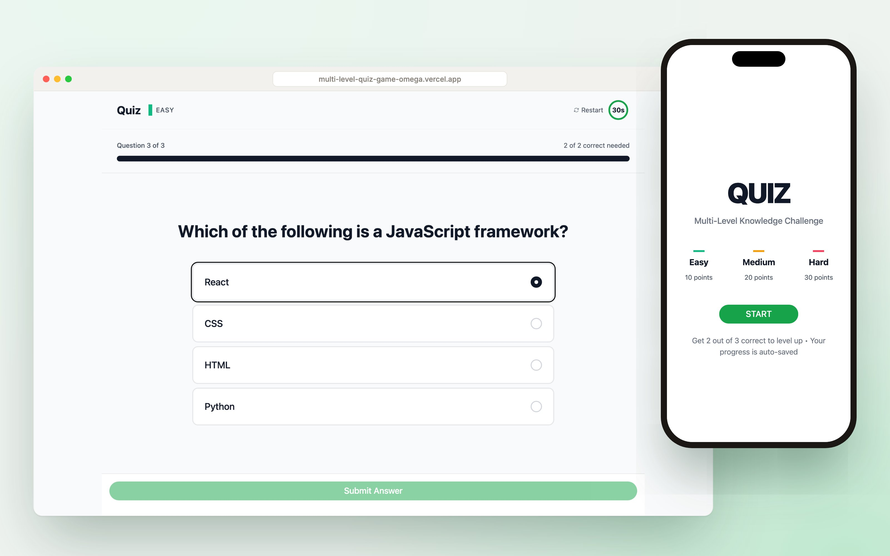
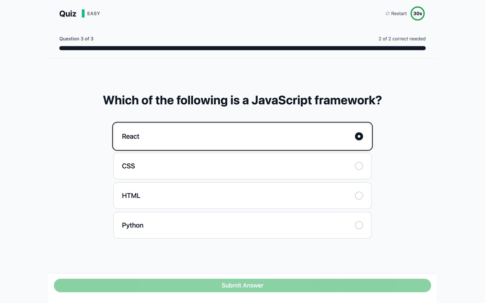
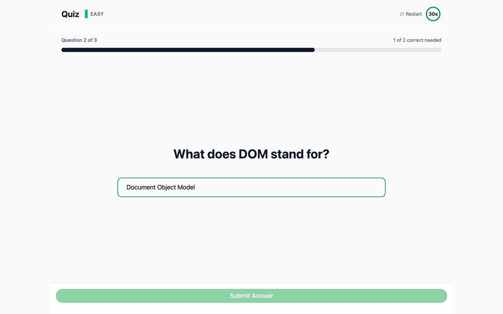
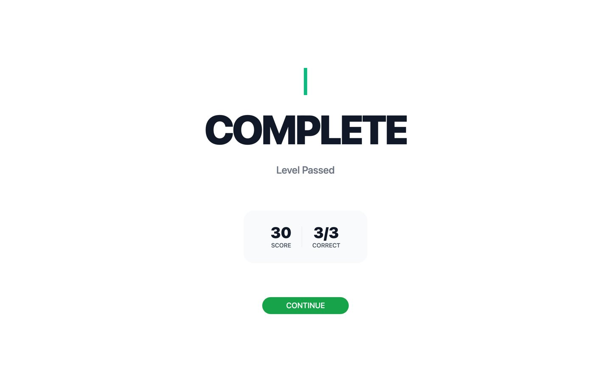
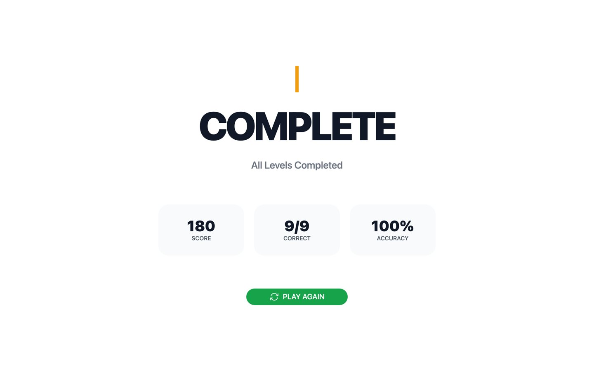

# Multi-Level Quiz Game

A quiz game built with React. Answer questions across three levels, beat the timer and level up as you go.

**[Play the live demo](https://multi-level-quiz-game-omega.vercel.app)**



## Features

- Three levels: Easy (10 points per answer), Medium (20) and Hard (30)
- Get 2 of 3 answers right to pass a level, or retry it
- 30 second timer on every question
- Three question types: multiple choice, true/false and typed answers
- Instant feedback after each answer
- Progress is saved in localStorage, so a refresh doesn't reset the game
- Level complete, failed and final results screens with score and accuracy
- Questions live in a JSON file, so adding new ones needs no code changes

## Screenshots

| Start | Question |
|---|---|
|  |  |

| Typed answer | Level complete |
|---|---|
|  |  |



## Tech stack

React 19 · React Router 7 · Vite · Tailwind CSS · Heroicons

## Project structure

```
src/
├── contexts/QuizContext.jsx    # game state: level, score, answers
├── hooks/                      # useTimer, useLocalStorage
├── components/
│   ├── questionTypes/          # multiple choice, true/false, text input
│   ├── quiz/                   # timer, level badge, restart
│   └── ui/                     # button, card, progress bar, feedback
├── pages/                      # start, quiz, level complete, failed, results
├── data/questions.json         # questions for each level
└── utils/                      # game rules and constants
```

## Run locally

```bash
npm install
npm run dev
```

## Adding questions

Add an entry to the right level in `src/data/questions.json`:

```json
{
  "type": "multiple-choice",
  "question": "Which company developed JavaScript?",
  "options": ["Microsoft", "Netscape", "Google", "Oracle"],
  "correctAnswer": "Netscape"
}
```

`type` can be `multiple-choice`, `true-false` or `text-input`.
